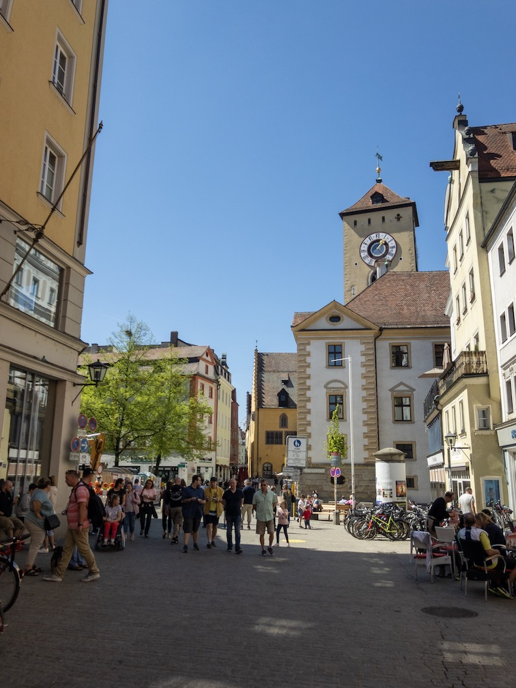
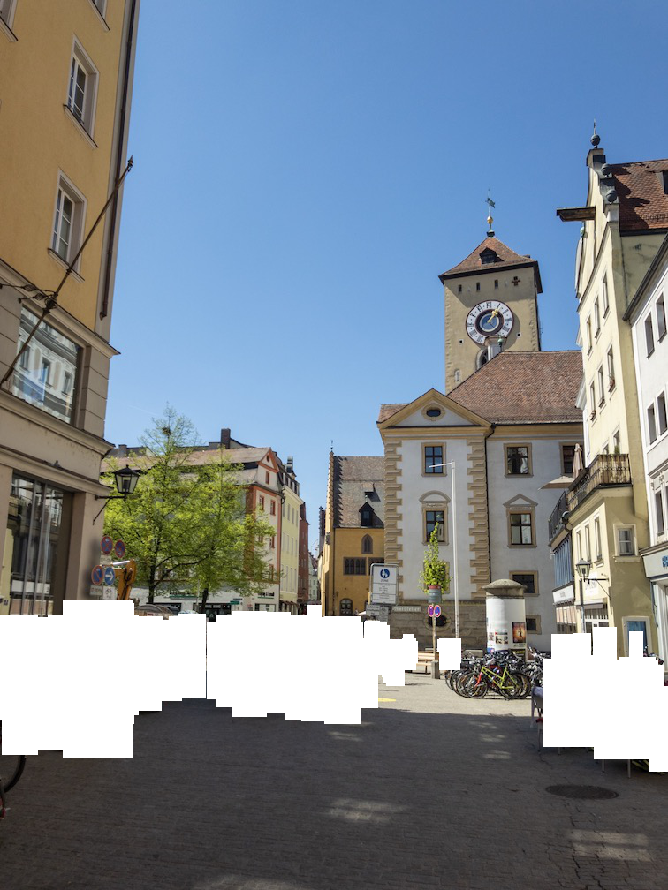
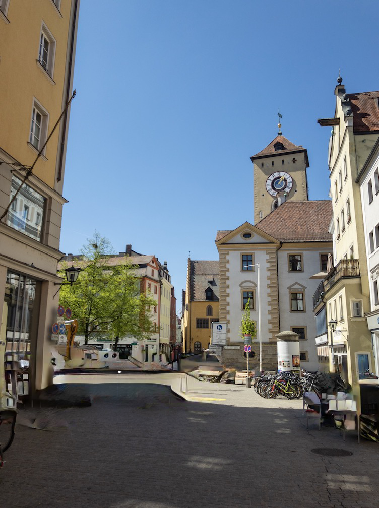
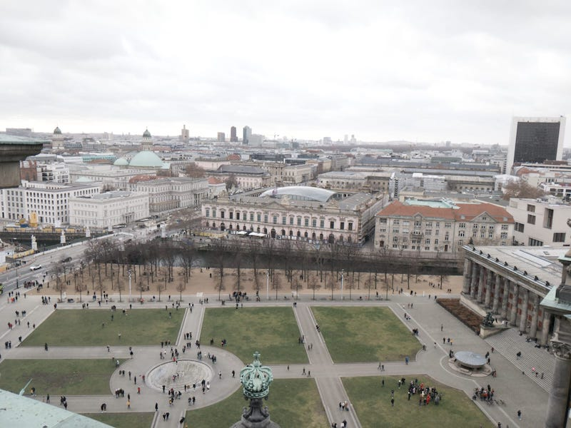
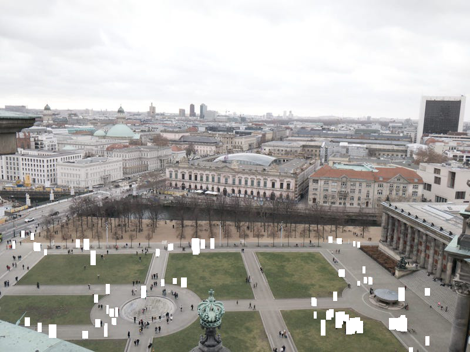
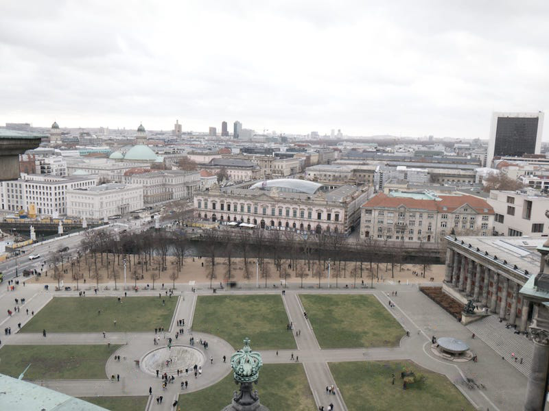

# ImagePatcher

Use MASK-RCNN and https://github.com/JiahuiYu/generative_inpainting to remove humans from images.

### Some examples:

#### Input:

#### First Detect People using Mask R-CNN (we used boxes instead of masks as this works better for inpainting)

#### Then Run Generative Inpainting to fill the missing parts

#### Or with a different picture

